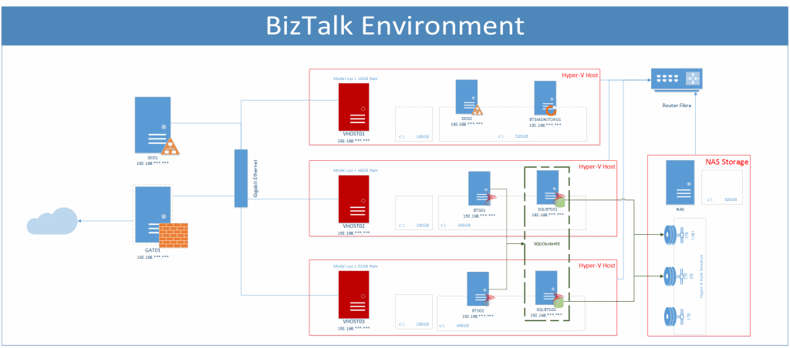
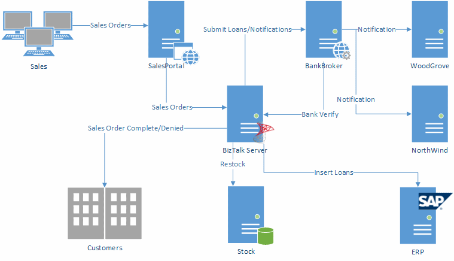

# BizTalk Infrastructure and Solution Overview Samples
Creating documentation is boring and it can be a challenging task. However documentation is an important part on every BizTalk Integration projects or for infrastructures operations management and administration. They will help you in many critical situation and will reduce the time needed to carry out different procedures like finding were the machines are hosted, how many machines your environment have, what are the actors (systems, protocols) in a given solution and so on. You can have at least three types of documentation when it comes to BizTalk:
* Infrastructure Overview
* Solution Overview
* Technical Overview

Or as Steef-Jan mentioned in one of this posts:
* BizTalk Environment (Design) document
* Functional Design of BizTalk Solution
* Technical (Design) of BizTalk Solution

Visio is great for creating multiple kinds of diagrams, unfortunately, the set of stencils and shapes, which out-of-the-box come with Visio provably are not sufficient to cover the kinds of diagrams we need with our BizTalk/Integration projects or they are not easy to use and read. Visio 2013 Stencil for BizTalk Server and Visio 2010 Stencil for BizTalk Server can easily help you creating documentation for the first two: BizTalk Environment (Design) document and Functional Design of BizTalk Solution. They are a collection of 73 modern flat Visio 2013 shapes that will help you representing BizTalk Server physical architectures, Integration architectures (Cloud or Hybrid scenarios) or solutions diagrams in Visio 2013 and 2010.

## Infrastructure Overview Samples
This logical diagram describes the overview of your BizTalk environments where you can specify the Infrastructure of your production, UAT, testing or developer environments.

 
## Solution Overview Samples
This logical diagram depicts a view of the solution. It will describe how solution will work, who are the actors, what type of protocols and so on.

# About Me
**Sandro Pereira** | [DevScope](http://www.devscope.net/) | MVP & MCTS BizTalk Server 2010 | [https://blog.sandro-pereira.com/](https://blog.sandro-pereira.com/) | [@sandro_asp](https://twitter.com/sandro_asp)
