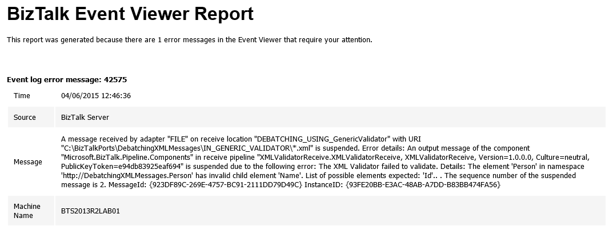

# Monitoring Event Viewer Errors in your BizTalk environment with PowerShell
Windows PowerShell is a Windows command-line shell designed especially for system administrators. It includes an interactive prompt and a scripting environment that can be used independently or in combination. PowerShell can be used by BizTalk administrators to help them in automating tasks and monitor certain resources or operations.

BizTalk Server writes all errors that occur in the environment in the Event Viewer Application Log.

So is important that you maintain this log clean of noise (custom application errors, warnings of information that you can use inside your code)

With this script you can be able to monitoring the Event Viewer for BizTalk Server related errors

This script allows you to set:
* The timeframe that you want to monitor, the Entry Type and the Sources
* And configure your email notification settings

Report sample:

 
THIS POWERSHELL & SQL SCRIPT ARE PROVIDED "AS IS", WITHOUT WARRANTY OF ANY KIND.

# About Me
**Sandro Pereira** | [DevScope](http://www.devscope.net/) | MVP & MCTS BizTalk Server 2010 | [https://blog.sandro-pereira.com/](https://blog.sandro-pereira.com/) | [@sandro_asp](https://twitter.com/sandro_asp)