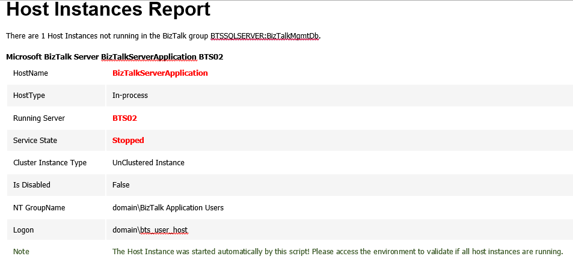

# Monitoring BizTalk Host Instances with Auto-Healing with PowerShell
One of the principal needs for BizTalk Administrators is the ability to monitor the health of BizTalk environments and react promptly to possible problems, you can accomplish this by using certain tools such as: BizTalk Administration Console; BizTalk360; SCOM and many more… However, unfortunately many times, some of these tools are not available for us but we still need to accomplish this task.

There are bunch of things that can go wrong and the longer they have in an error/failure situation, more impact could have in your business! So, we don't just want to be notified of failures (that will always lead to a manual human intervention) but instead, when possible, be also able to try to automatically fix it, bringing them to the desired state (running, resumed, enable - depending on the artifact)

With this script you can be able to monitoring your BizTalk environment for Host Instance that aren’t Started (Stopped, Start pending, Stop pending, Continue pending, Pause pending, Paused or Unknown), and automatically bring them to desired state (Started) according to certain conditions, using PowerShell.

This script allows you to set:
* Set your email notification settings

Here is example expected report output from running the Windows PowerShell script sample, if any of the Host instance are in an unwanted state.

THIS POWERSHELL IS PROVIDED "AS IS", WITHOUT WARRANTY OF ANY KIND.

# About Me
**Sandro Pereira** | [DevScope](http://www.devscope.net/) | MVP & MCTS BizTalk Server 2010 | [https://blog.sandro-pereira.com/](https://blog.sandro-pereira.com/) | [@sandro_asp](https://twitter.com/sandro_asp)