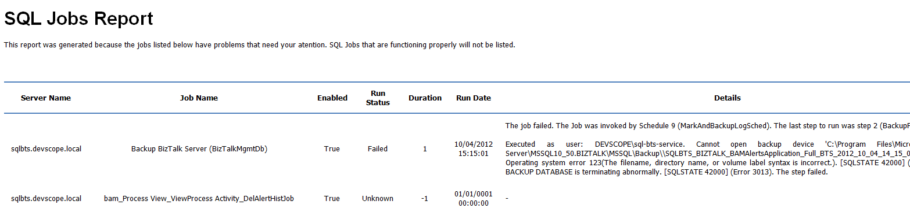

# Monitoring SQL Agent Jobs in your BizTalk environment with PowerShell
Windows PowerShell is a Windows command-line shell designed especially for system administrators. It includes an interactive prompt and a scripting environment that can be used independently or in combination. PowerShell can be used by BizTalk administrators to help them in automating tasks and monitor certain resources or operations.

With this script you can be able to monitoring SQL Agent Jobs in your BizTalk environment using PowerShell. BizTalk is shipped out with a total of 12 SQL Agent jobs. 2 of these jobs must be configured. The two jobs that needs configuration are the two most important jobs. The "Backup BizTalk Server" and the "DTA Purge and Archive".

This script allows you to set:
* A range of machines you need to monitor
* Configure list of SQL Job that will not be subject to monitoring
* And configure your email notification settings

The script will monitor the JQL Agent Jobs in all machines and you will receive an email with a list of all jobs listed that have problems and need your atention. SQL Jobs that are functioning properly will not be listed.

Report sample:

 
THIS POWERSHELL & SQL SCRIPT ARE PROVIDED "AS IS", WITHOUT WARRANTY OF ANY KIND.

# About Me
**Sandro Pereira** | [DevScope](http://www.devscope.net/) | MVP & MCTS BizTalk Server 2010 | [https://blog.sandro-pereira.com/](https://blog.sandro-pereira.com/) | [@sandro_asp](https://twitter.com/sandro_asp)