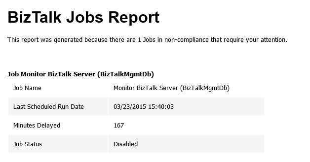

# Monitoring BizTalk SQL Agent Jobs with PowerShell
Windows PowerShell is a Windows command-line shell designed especially for system administrators. It includes an interactive prompt and a scripting environment that can be used independently or in combination. PowerShell can be used by BizTalk administrators to help them in automating tasks and monitor certain resources or operations.

BizTalk is shipped out with a total of 12 SQL Agent jobs. 2 of these jobs must be configured. The two jobs that needs configuration are the two most important jobs. The "Backup BizTalk Server" and the "DTA Purge and Archive".

With this script you can be able to monitoring SQL Agent Jobs in your BizTalk environment using PowerShell, checking:
* If the jobs are being executed according to the schedulers that are configured
* If all jobs (with the exception of MessageBox_Message_Cleanup_BizTalkMsgBoxDb) are enable
* If MessageBox_Message_Cleanup_BizTalkMsgBoxDb is disable

This script allows you to set:
* The Jobs execution timeframe
* And configure your email notification settings

Report sample:

 
THIS POWERSHELL & SQL SCRIPT ARE PROVIDED "AS IS", WITHOUT WARRANTY OF ANY KIND.

# About Me
**Sandro Pereira** | [DevScope](http://www.devscope.net/) | MVP & MCTS BizTalk Server 2010 | [https://blog.sandro-pereira.com/](https://blog.sandro-pereira.com/) | [@sandro_asp](https://twitter.com/sandro_asp)