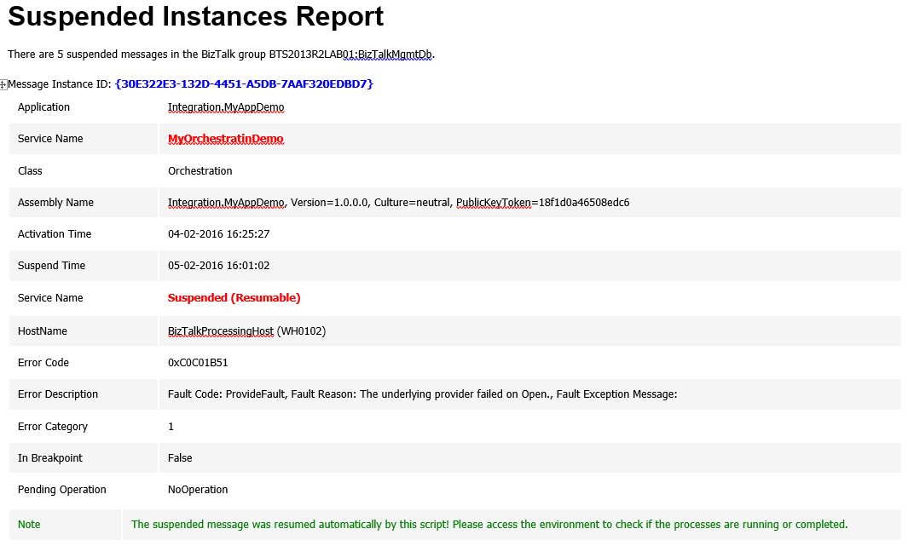

# Monitoring BizTalk Suspended Service Instances with Auto-Healing with PowerShell
One of the principal needs for BizTalk Administrators is the ability to monitor the health of BizTalk environments and react promptly to possible problems, you can accomplish this by using certain tools such as: BizTalk Administration Console; BizTalk360; SCOM and many more… However, unfortunately many times, some of these tools are not available for us but we still need to accomplish this task.

There are bunch of things that can go wrong and the longer they have in an error/failure situation, more impact could have in your business! So, we don't just want to be notified of failures (that will always lead to a manual human intervention) but instead, when possible, be also able to try to automatically fix it, bringing them to the desired state (running, resumed, enable - depending on the artifact) 

This script allows you to set:
* Set your email notification settings
* The Service Instances desired states to monitor
* The amount of hours that a suspended message can be resumed automatically. Only if the (Current Date - Automatic Resume hours) is less than Instance start time, the instance will be automatically resumed. 

Only if the script finds any suspended messages a mail notification will be sent.

THIS POWERSHELL IS PROVIDED "AS IS", WITHOUT WARRANTY OF ANY KIND.

# About Me
**Sandro Pereira** | [DevScope](http://www.devscope.net/) | MVP & MCTS BizTalk Server 2010 | [https://blog.sandro-pereira.com/](https://blog.sandro-pereira.com/) | [@sandro_asp](https://twitter.com/sandro_asp)