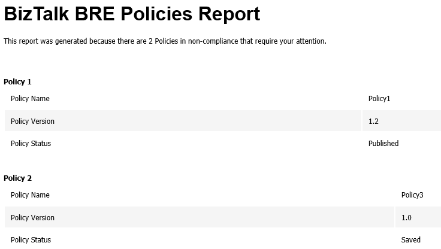

# Monitoring BRE Policies in your BizTalk environment with PowerShell
Windows PowerShell is a Windows command-line shell designed especially for system administrators. It includes an interactive prompt and a scripting environment that can be used independently or in combination. PowerShell can be used by BizTalk administrators to help them in automating tasks and monitor specific resources or operations.

With this script, you can be able to your BizTalk Server BRE Policies, highest versions, that aren’t in the deployed state. Only if the script finds any non-compliance, an email notification will be sent.

This script allows you to set and configure:
* your email notification settings
* a SQL Server script to check what rules are in a non-compliance state 

The script will monitor the BRE Policies and you will receive an email with a list of all Policies listed with potential problems and that need your attention. 

Report sample:

 
THIS POWERSHELL & SQL SCRIPT ARE PROVIDED "AS IS", WITHOUT WARRANTY OF ANY KIND.

# About Me
**Sandro Pereira** | [DevScope](http://www.devscope.net/) | MVP & MCTS BizTalk Server 2010 | [https://blog.sandro-pereira.com/](https://blog.sandro-pereira.com/) | [@sandro_asp](https://twitter.com/sandro_asp)