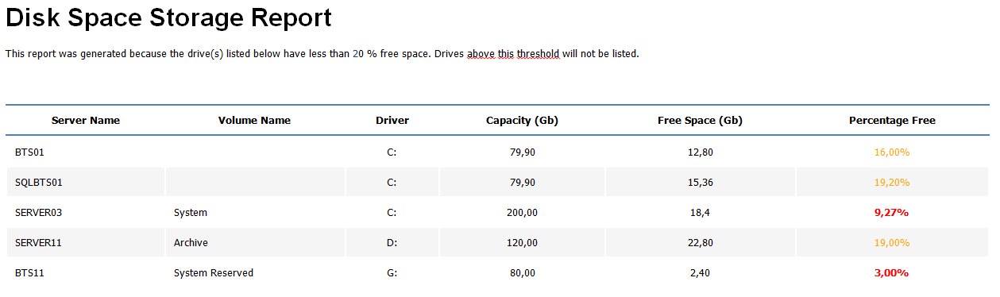

# Monitoring disk spaces in your BizTalk environment with PowerShell
Windows PowerShell is a Windows command-line shell designed especially for system administrators. It includes an interactive prompt and a scripting environment that can be used independently or in combination. PowerShell can be used by BizTalk administrators to help them in automating tasks and monitor certain resources or operations.

With this script you can be able to monitoring disk spaces in your environment (BizTalk/SQL/Other machines) using PowerShell.

This script allows you to set:
* A range of machines you need to monitor
* Configure disk free space warning and critical level
* And configure your email notification settings

The script will monitor the disk space in all machines and you will receive an email with a list of all disk that are below the threshold set. If all the disks are above the threshold set is not sent any email.

Report Sample:

THIS POWERSHELL IS PROVIDED "AS IS", WITHOUT WARRANTY OF ANY KIND.

# About Me
**Sandro Pereira** | [DevScope](http://www.devscope.net/) | MVP & MCTS BizTalk Server 2010 | [https://blog.sandro-pereira.com/](https://blog.sandro-pereira.com/) | [@sandro_asp](https://twitter.com/sandro_asp)