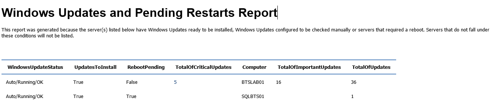

# Monitoring Windows Updates and Pending Restarts on the servers using PowerShell
**Windows PowerShell** is a Windows command-line shell designed especially for system administrators. It includes an interactive prompt and a scripting environment that can be used independently or in combination. PowerShell can be used by BizTalk administrators to help them in automating tasks and monitor certain resources or operations.

Monitoring Windows Updates and Pending Restarts on the servers using PowerShell
For me it’s very important that administrators deploy the latest Microsoft product updates to servers that are running the Windows operating system. By doing this they will address and solved known issues or vulnerabilities in Microsoft products and they will keep the environment constantly updated. However when we are working with several teams (system administrators, network administrator, BizTalk administrators and so on) or sometimes without system administrators teams this task normally are forgotten or postponed several times. 

Although there are occasions when updates can cause a new issue to appear, generally speaking they will help solving problems. However, for this reason, you should install and tested this updates in developing or testing environment before you installed in production.

For this reasons I like to monitor and know if the servers that are running on my BizTalk environment has some updates available to install or for some reason they required a restart, so that I take actions without the need of constantly have to check this manually in all the servers.

This script allows you to set:
* A range of machines you need to monitor
* And configure your email notification settings

The script will monitor all the servere with Windows Updates ready to be installed, Windows Updates configured to be checked manually or servers that required a reboot. Servers that do not fall under these conditions will not be listed.

 
THIS POWERSHELL IS PROVIDED "AS IS", WITHOUT WARRANTY OF ANY KIND.

# About Me
**Sandro Pereira** | [DevScope](http://www.devscope.net/) | MVP & MCTS BizTalk Server 2010 | [https://blog.sandro-pereira.com/](https://blog.sandro-pereira.com/) | [@sandro_asp](https://twitter.com/sandro_asp)