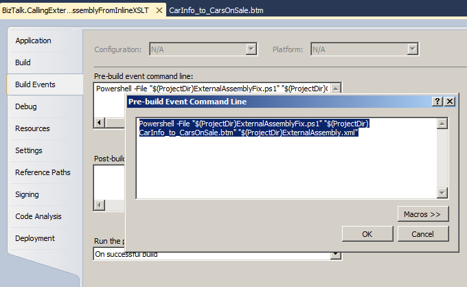

# BizTalk Mapper: Custom Extension XML property fix with PowerShell (BizTalk 2010)
BizTalk Server 2010/Visual Studio 2010 have an issue with this functionality: Visual Studio doesn’t persist the path of Custom Extension XML property in the .BTM file.

The workaround that currently exists requires that the user edit manually and .BTM file to add this node between the elements </ScriptTypePrecedence> and <TreeValues>:

However this is a workaround that can cause many problems, especially maintaining this issue.

This PowerShell script, associated with the Pre-build actions of Visual Studio project, will allow resolving this issue automatically.

The script accepts two parameters:
* The first parameter is the path to the map that we want to configure the custom extension XML;
* The second is the path to the ExternalAssembly.xml file file that refers the namespace to the FullyQualifiedName (FQN) of the .NET assembly.

Then we need to configure Pre-build actions of Visual Studio project to run this script:
* Copy the PowerShell script file: ExternalAssembluFix.ps1 to your project directory;
* Right-click on BizTalk project name and select “Properties” option;
* On the right three choose “Build Events” option:
* Select the button “Edit Pre-Build …” and in the “Pre-Build event command line” windows type the following command:
  * Powershell -File "$(ProjectDir)ExternalAssemblyFix.ps1" "$(ProjectDir)<name_of_the_map>" "$(ProjectDir)ExternalAssembly.xml"

**Note**: you must replace <name_of_the_map> with the name of your map.

Everytime we made a build to the project, the PowerShell script will check of the element CustomXSLT  is present in the map:
* if not he will insert automatic this element
* if the element is present, the script will not do anything.
 
THIS POWERSHELL IS PROVIDED "AS IS", WITHOUT WARRANTY OF ANY KIND.

# About Me
**Sandro Pereira** | [DevScope](http://www.devscope.net/) | MVP & MCTS BizTalk Server 2010 | [https://blog.sandro-pereira.com/](https://blog.sandro-pereira.com/) | [@sandro_asp](https://twitter.com/sandro_asp)