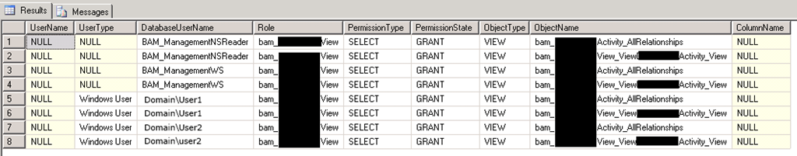

# Query for list all users with access to specify BAM View
This query will give us an list of all users with access to specify BAM View:

Administrators of Business Activity Monitoring (BAM) definitions use the BAM Management utility to manage and maintain all aspects of the BAM infrastructure.

When you execute the deploy-all command using “bm.exe” tool, BAM automatically creates the underlying data model for you activities and views in BAM Primary Import database (BAMPrimaryImport)

However when users are improperly removed of AD or Local Computer, administrators lose the ability to use this tool (BM.exe) and BAM Portal ceases to function properly. The solution is to run this kind of queries in order to validate what users are causing the problem.

## Real-Time Aggregations

Real-time aggregations (RTA) allow a business user to see information on business processes that will change during the day (for example if you refresh your screen the data may have changed). RTA data is available via dynamically created views in the BAM Primary Import Database.

## BAM Portal and Aggregations in the BAM Portal

The BAM Portal is an ASP.net web application which allows business users to view the information held in BAM. 

Aggregations are tables of precalculated data you can use for analytical processing with an OLAP cube. Aggregations facilitate the efficient querying of multidimensional databases. When you create and deploy your observation model (the high-level definition of your business data) using the BAM Add-In for Excel, you create aggregations that you can use to quickly evaluate collections of data relating your Key Performance Indicators (KPIs).

Aggregations can be either scheduled or real-time. Scheduled aggregations are OLAP cubes, which represent a snapshot of your business data at a time you specify. Real-time aggregations allow a view of your business data based on trigger points that you specify, allowing the BAM system to notify you through an alert as soon as a KPI has been reached.

## Security Considerations for the BAM Portal
Using the principle of least privilege, user accounts should have restrictive permissions to perform routine tasks in the BAM portal. Keep the following points in mind as you set up your user accounts for BAM to balance security with appropriate access for users.

## User accounts

User accounts with minimum permissions are not able to use the BAM portal distributed navigation feature. To be able to use this feature, these accounts must have sufficient permissions to allow access to the Web services on the remote computer as well as on the local computer.

User accounts for the BAM Web services must have permissions to access all referenced databases and must be a member of the BAM_ManagementWS role in the referenced databases.

For the following user types, you should be aware of these considerations:
* Domain Users: These users must have access permissions on remote computers that host BAM Primary Import databases that are being accessed.
* Local User: Users who are assigned this role cannot use distributed navigation.
* Administrator accounts

Administrators must be members of the securityadmin or sysadmin groups to grant permissions to domain users.

To run the BAM Management utility, you must be at least a database operator for the BAM databases.
 
THIS SQL SCRIPT IS PROVIDED "AS IS", WITHOUT WARRANTY OF ANY KIND.

# About Me
**Sandro Pereira** | [DevScope](http://www.devscope.net/) | MVP & MCTS BizTalk Server 2010 | [https://blog.sandro-pereira.com/](https://blog.sandro-pereira.com/) | [@sandro_asp](https://twitter.com/sandro_asp)