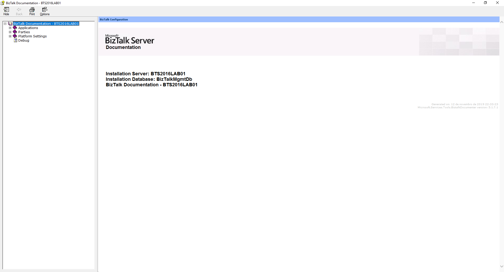

# BizTalk Documenter tool: Cover Customization Resources
The BizTalk Documenter has been available for many years and different BizTalk versions, starting with 2004 to the latest one: BizTalk Server 2016. And once again, without a doubt for me, BizTalk Documenter is my favorite documentation tool, and I do think that if each product had a tool like for the generation of technical documentation, it would be simpler to do, as the existing documentation significantly improved.

However, the default cover page is quite simple and looks old fashion:

And I normally like to personalize my documentation according to the client like:
* Using the Logotype and there name on the cover;
* Using their color pattern;
* Sometimes using some cover picture;

So, the question here is: Can we customize the cover page produce by BizTalk Documenter?

And the answer is obviously: yes, of course, you can.

These are the resources you need to customize the cover page. Check more information in this blog post:
* https://blog.sandro-pereira.com/2019/11/12/biztalk-documenter-tool-how-to-customize-the-cover-page/
 
THIS IS PROVIDED "AS IS", WITHOUT WARRANTY OF ANY KIND.

# About Me
**Sandro Pereira** | [DevScope](http://www.devscope.net/) | MVP & MCTS BizTalk Server 2010 | [https://blog.sandro-pereira.com/](https://blog.sandro-pereira.com/) | [@sandro_asp](https://twitter.com/sandro_asp)