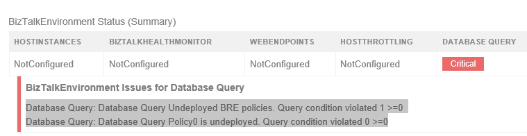

# BizTalk360 Monitor BRE Undeployed policies alarm
[BizTalk360](https://www.biztalk360.com/) offers a tool for BizTalk Administrators to monitor a BizTalk Solution by running database queries that can be evaluated against a defined threshold and receive alerts when the query does not return the expected values. The administrators can set the warning and error condition values in BizTalk360. In addition, they also need to provide the SQL Instance Name and the Database Name where the query will be executed and can target any database. The database query monitoring requires queries that return a scalar value such as string, integer or Boolean. Once the query is saved, BizTalk360 checks for the query result and alerts the administrator when the value exceeds the threshold range.

This JSON file configuration contains all the configurations for you to create an alarm and two database queries with a defined threshold that in case on not being in an expected state will notify you that there are BRE Policies, highest versions, that aren’t in the deployed state.

THIS BIZTALK360 CONFIGURATION IS PROVIDED "AS IS", WITHOUT WARRANTY OF ANY KIND.

# About Me
**Sandro Pereira** | [DevScope](http://www.devscope.net/) | MVP & MCTS BizTalk Server 2010 | [https://blog.sandro-pereira.com/](https://blog.sandro-pereira.com/) | [@sandro_asp](https://twitter.com/sandro_asp)