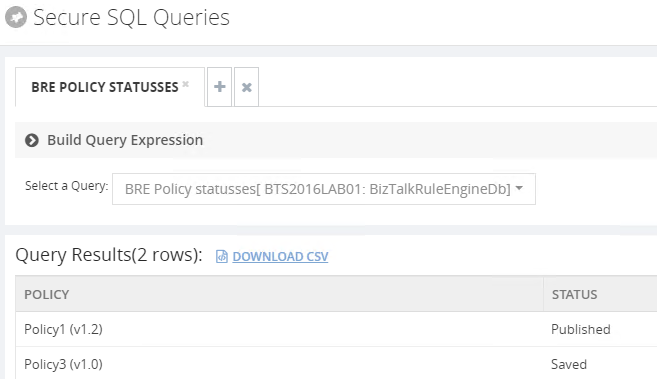

# BizTalk360 Secure SQL Server Query to check BRE that are not in a Deployed state
[BizTalk360](https://www.biztalk360.com/) allows you to create “Secure SQL Queries” that allow us to:
* Write optimized SQL queries and store them with friendly names in BizTalk360
* Assign who will have permissions to run the queries
* and run the queries, of course

This will allow us to easily check if any policy is in a non-compliance state.

With this SQL Server Query, you can check what are all your BizTalk Server BRE Policies, highest versions, that aren’t in the deployed state.

THIS BIZTALK360 SQL SERVER QUERY IS PROVIDED "AS IS", WITHOUT WARRANTY OF ANY KIND.

# About Me
**Sandro Pereira** | [DevScope](http://www.devscope.net/) | MVP & MCTS BizTalk Server 2010 | [https://blog.sandro-pereira.com/](https://blog.sandro-pereira.com/) | [@sandro_asp](https://twitter.com/sandro_asp)