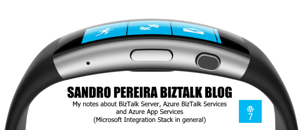

# SandroaspBizTalkBlog Web Tile for Microsoft Band
Microsoft Band helps you live healthier and achieve more by tracking your heart rate, exercise, calorie burn, and sleep quality, and helps you be productive with email, text, and calendar alerts… and now also your favorite blog (or not :))

I had (and still have) the original Microsoft Band but on my last trip to the United States, in which I was attend in another MVP Summit in Redmond, I decided to buy the new Microsoft Band 2 and while I was searching about new features and capabilities I found out that Microsoft had announced, more or less this last July, some new features and functionality for both the Microsoft Band and Microsoft Health, especially the Web Tiles. And with that, the capability for this device to receive glanceable information from nearly any source.

So, just for fun I decide play around with this features and create the SandroaspBizTalkBlog Web Tile that will allow you to “track” my blog from your new or old Microsoft Band.

This way, when a new blog post will be published you will receive a notification on your wrist!

# About Us
**Sandro Pereira** | [DevScope](http://www.devscope.net/) | MVP & MCTS BizTalk Server 2010 | [https://blog.sandro-pereira.com/](https://blog.sandro-pereira.com/) | [@sandro_asp](https://twitter.com/sandro_asp)
